# 哔哩存档姬

自动帮你存档备份收藏夹、历史记录、UP主。支持视频、弹幕、评论的存档。

**这是一个面向NAS的应用**，7x24小时运行。

本软件使用springboot做为后端，vue3作为前端。需要安装ffmpeg，这是视频合并（画面与音频）的依赖。

个人认为后端架构做得很烂，会技术的大佬可以指点一下。

**软件处于测试阶段，遇到问题请及时反馈！**

## 警告

**本程序没有实现权限与登录机制，所有人都可以进入站点进行操作，请确保在安全的网络环境中运行！！！**

**本程序没有实现权限与登录机制，所有人都可以进入站点进行操作，请确保在安全的网络环境中运行！！！**

**本程序没有实现权限与登录机制，所有人都可以进入站点进行操作，请确保在安全的网络环境中运行！！！**

# 软件界面

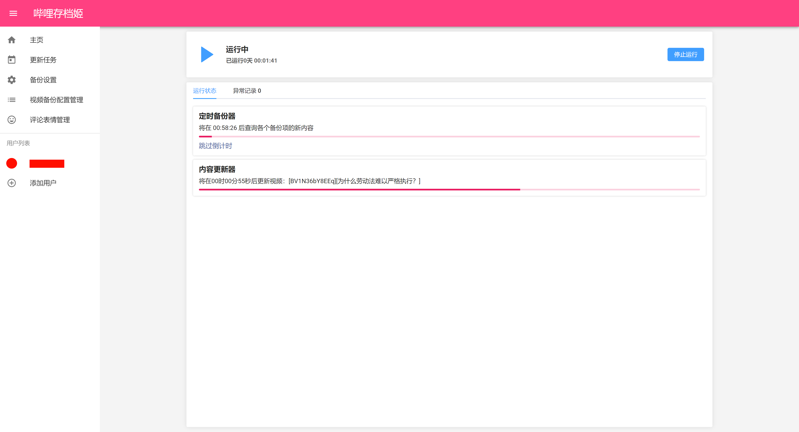

视频播放

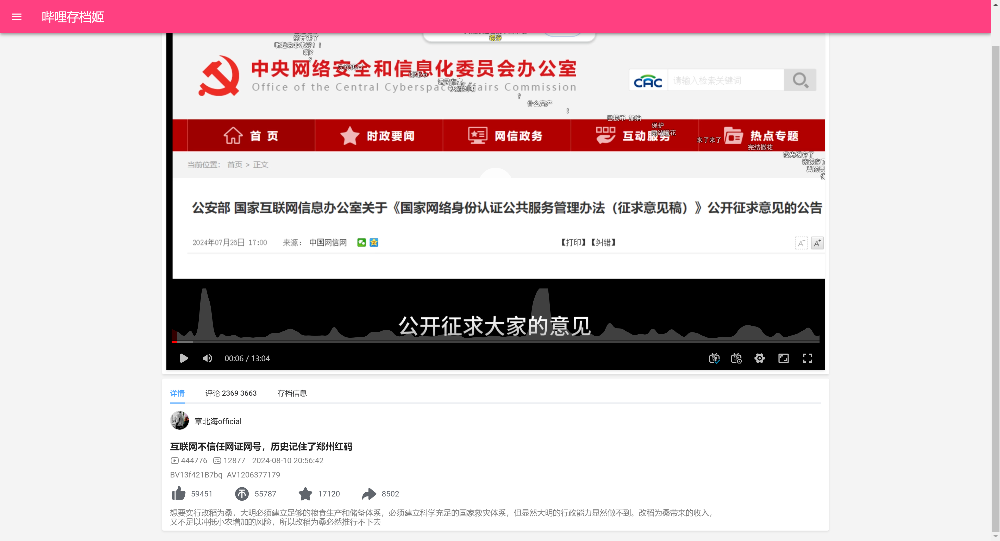

评论预览，评论数字含义： 汇报数量 已存档的数量

PS：哈哈哈，阿瓦隆杀疯了。5分一次增量模式评论更新，最后竟然存到的数量比汇报的数量还多出来这么多！不知有多少评论遭到秋后算账😰

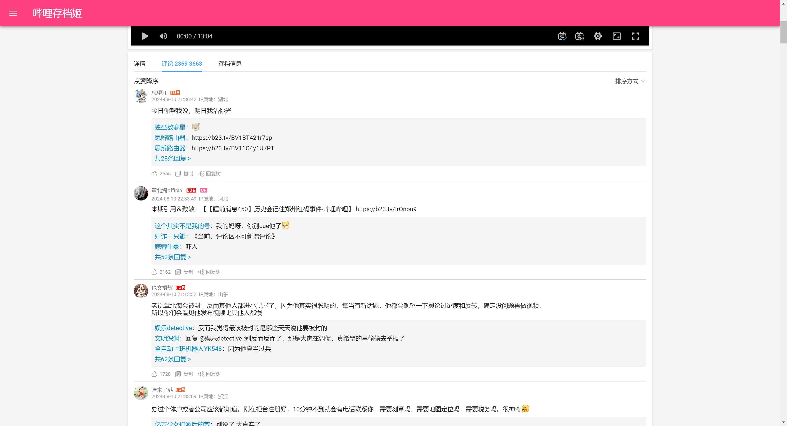

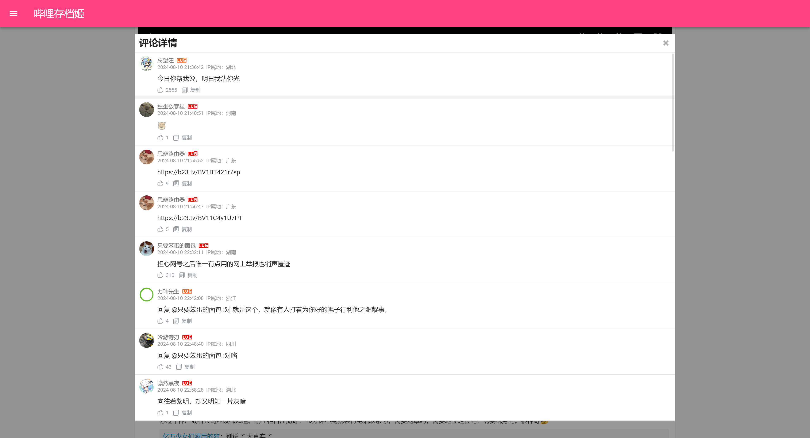

评论回复树，b站官方也没有的功能哟！后期考虑做成油猴插件

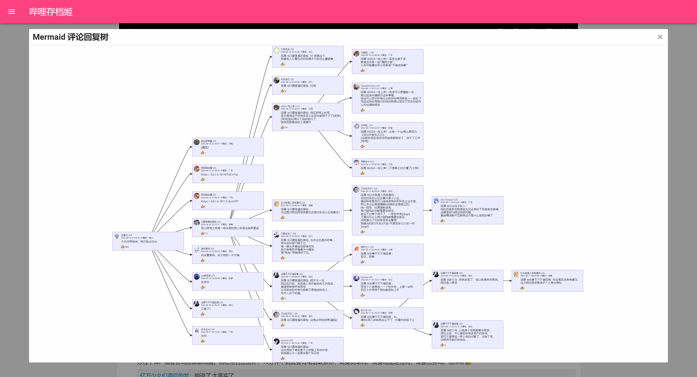

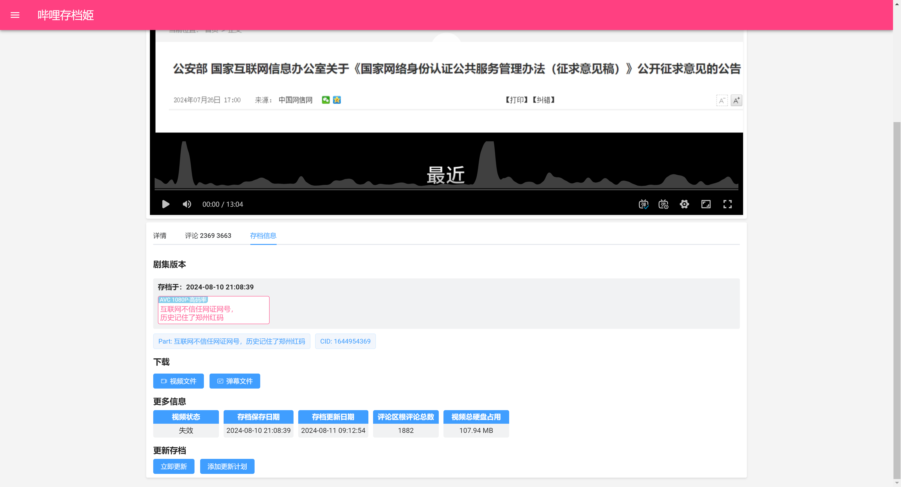

# 部署使用

## 运行

运行环境依赖（安装教程自行搜索）

- Java17
- ffmpeg

到release下载编译好的jar，拷贝到一个用于存档的目录，命令行执行`java -jar xxx.jar`运行本应用，浏览器输入 你的IP地址:8080 访问应用。

linux下可用screen命令，新建一个窗口`screen -R bili`，然后运行本程序，在退出ssh后，`screen -r bili`即可恢复，更多screen命令的用法可自行搜索。

运行效果。运行成功后，同级目录下会自动创建一些用于存放数据的文件与文件夹。

Java启动添加命令行参数`-start`，在启动后将同时启动备份（用于来电自启的场景）

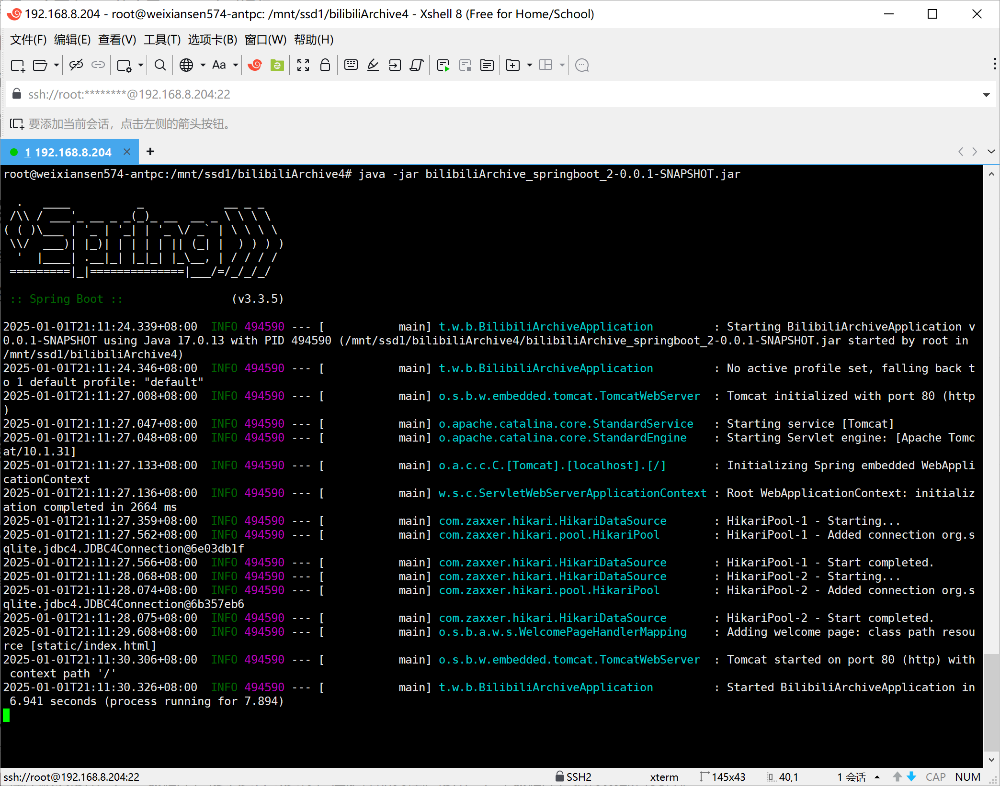

## 配置文件

程序内置一个配置文件。若要修改配置，如修改服务器端口，请在jar文件下面创建一个`application.yml`，可以直接复制粘贴下面的内容，或者从release或项目源代码下载application.yml文件。

```yaml
files:
  root: "${user.dir}"
  backup-settings-file: "${files.root}/backup_settings.json" #备份设置文件
  archives: "${files.root}/archives" #存档文件夹 （视频、评论等）
  backup-config-avatars: "${files.root}/backup_config_avatars" #备份配置的用户头像文件（账号用户头像、UP主备份的头像）
  logs: "${files.root}/logs" #HTTP 请求的日志，http-req.logging 启用后，日志将存到这里。一般用不到
  cache: "${files.root}/cache" #视频下载的缓存，纯视频与音频文件先下载到这里，然后ffmpeg进行合并到视频文件夹
  videos: "${files.archives}/videos" #视频文件的保存路径，子文件是BV号文件夹，对应一个视频，内包含封面、视频、弹幕文件
  comment-pictures: "${files.archives}/comment_pictures" #评论图片的保存文件夹
  uploader-avatars: "${files.archives}/uploader_avatars" #UP主头像的保存文件夹，注意这与备份配置的UP主头像不一样
  emote: "${files.root}/emote" #评论表情的保存文件夹，例如[doge]这类表情的图片。

spring:
  datasource: #数据库
    master: #主
      jdbc-url: "jdbc:sqlite:${files.root}/bilibili_archive.db?journal_mode=WAL"
      driver-class-name: "org.sqlite.JDBC"
      #maximum-pool-size: 1 #数据库连接池大小，仅对非sqlite数据库生效，sqlite默认为1且即使设置此值也不会生效。可不填来使用默认
    comment: #评论
      jdbc-url: "jdbc:sqlite:${files.archives}/comments.db?journal_mode=WAL"
      driver-class-name: "org.sqlite.JDBC"
      #maximum-pool-size: 1
  mvc:
    static-path-pattern: /**  # 静态资源路径，请勿修改

server:
  port: 8080 #服务器端口

http-req: #网络请求，调用B站API用的
  logging: false #启用日志
  user-agent: "Mozilla/5.0 (Windows NT 10.0; Win64; x64) AppleWebKit/537.36 (KHTML, like Gecko) Chrome/127.0.0.0 Safari/537.36" #请求头的user-agent字段
  max-retries: 15 #API请求出现网络异常后重试的次数
```

## 开始使用

到添加用户这里，输入Cookie即可添加（扫码登录尚未开发），自动获取对应的用户。可以使用CookieEditor这个浏览器插件来提取b站Cookie。

添加用户完成后，先不急着去添加收藏夹之类的备份。到视频备份配置这里，新建一个视频备份配置，名称随意，接着按需编辑视频备份配置。

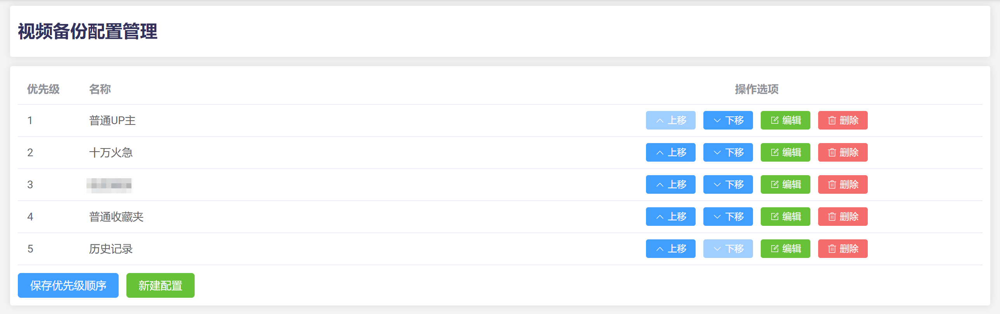

接着去弄收藏夹等备份项的时候就可以选此备份配置。

说一下为啥要把视频备份配置单独分出来？让我们想象一下

> 有多个收藏夹，都收藏了一个视频，如果都进行单独的下载，势必造成硬盘浪费。
>
> 如何处理这些问题？当然是存档库里视频都唯一的。但我还希望每个收藏夹都能有自己的视频下载配置，比如一个只想下1080p，一个想下4k。
>
> 这时，我就提出了配置与优先级的概念。每个配置都有他的优先级。进行存档的时候，当两个收藏夹同时新增了同一个视频，按照优先级最高的配置来下载。当之前存档了一个视频，现在优先级更高的收藏夹新增了同一个视频，如果视频画质不一致时覆盖下载，评论无论如何也将进行覆盖下载但是不会删除之前下载的评论。

在创建收藏夹、历史记录、up主、等备份项的时候就引用某个视频备份配置，从而处理优先级的问题。当然这里为了能够轻松的进行配置优先级的修改，优先级不是一个特定的数值，而是在列表里的顺序，以这些配置ID的位置作为优先级。在`backup_settings.json`里，例如`"videoBackupPriorityList":[4,3,5,1,2]`，所以请不要随便用文本编辑器去改这个文件，否则会出问题。

### 视频备份配置

视频下载，最高清晰度，如果你是大会员可以选择1080P以上画质，如果不是，即使你选了大会员画质，下载的还是1080P普通画质。

关于编码的选择，推荐H265

- H264，空间占用较大，兼容性完美

- H265，省空间，兼容性可以，只要不是上古显卡或问题卡都能解码
- AV01，最省空间，但在手机上的兼容性感人，PC的Chrome如果没有硬解起码还可以软件解码。手机（WebView）没有硬解就没得看了，因为没有软解，并且8gen2以上CPU才支持AV1的硬解。

关于评论配置

- 所有评论，顾名思义，下载所有

- 热门评论，下载热门排序下的，可进行数量限制。回复相关设置：
  - 下载全部
  - 增量更新：评论更新所使用的，反向翻页（从新往旧），直到 日期 < 本地最新此评论回复评论的日期 时停止
  - 带限制的从旧到新：支持数量限制，旧到新
  
- 增量更新：评论更新所使用的，从新往旧，直到 日期 < 本地最新根评论的日期 时停止


关于更新，视频的弹幕，评论都会随着时间的变化而新增，所以要有更新机制。

**更新任务的起点是视频发布时间**，不是备份的时间。

顾名思义的东西不说了。

若更新时，视频的分p信息发生变化，将创建新的剧集版本列表，可以保存视频的历史版本，以处理视频被修改的情况。例如这个

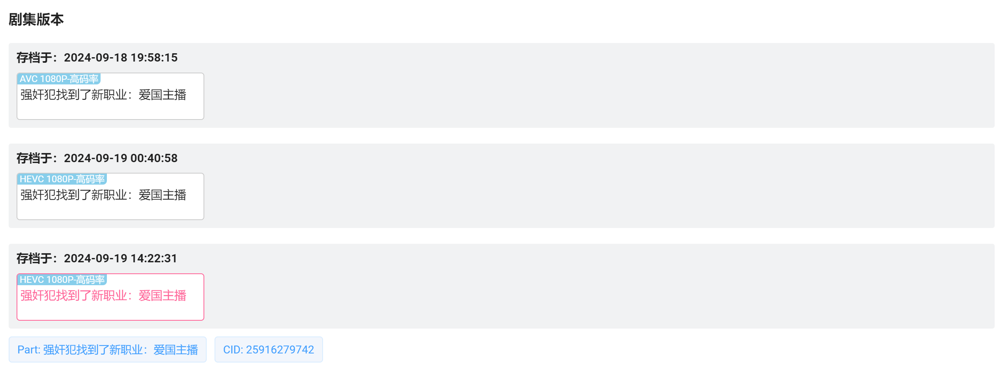

更新配置可以设置多个，为了解决这样的问题：我们没法预测什么时候失效，如果间隔太长，最后一次更新与视频失效相隔时间，新增的评论弹幕就失去了。视频前期的评论弹幕较少，且前期的评论增长较快（评论有被秋算的可能），在前期的时候备份就要频繁一点，比如半个小时一次甚至五分钟一次。然后后期逐渐的减少更新频率。

使用热门与全部下载，**若评论若数据库中已存在该评论，将更新他的点赞**，同时有新回复也会保存到数据库中。

评论的二次更新三次更新是什么？这是为了解决增量更新模式下，热门前几的评论的点赞数与回复评论不能更新的问题。就诞生了双端更新模式，先进行增量更新然后，然后再更新热门前几的评论。

那么间隙是什么？

图例：▩执行更新，▤不执行更新，▨忽略掉的

> ▩▩▩▩▩▩▩▩▩▩▩▩▩▩▩
>
> ▤▤▩▤▤▩▤▤▩▤▤▩▤▤▩

如“图”，在原来的循环基础上，空出来一部分次数不进行那个备份。

最后是第三次更新，可以做如下配置：第一次是增量，第二次是热门，第三次是全部。通常第三次的间隙比第二次还要大，如果第三次与第二次重合，第二次更新将不执行。

> ▩▩▩▩▩▩▩▩▩▩▩▩▩▩▩
>
> ▤▤▩▤▤▩▤▤▨▤▤▩▤▤▩
>
> ▤▤▤▤▤▤▤▤▩▤▤▤▤▤▤

[分享我收藏夹的更新配置](pictures/PixPin_2025-01-02_09-42-58.png)（图片太长，请点击查看）


### 收藏夹备份

首先是收藏夹。点击添加收藏夹，这里会列出你用户的收藏夹列表。当然你也可以使用输入ID的方式，添加别人的收藏夹，帮助你的朋友来备份！前提是收藏夹要设置为公开的。

如何获取收藏夹ID？可以到web版的哔哩哔哩，点开具体的收藏夹，然后到浏览器地址栏这里，你会看到这一串URL

`https://space.bilibili.com/{uid}/favlist?fid={fid}&ftype=create`

例如`fid=2233`，2233就是收藏夹的ID

接着是收藏夹的备份配置

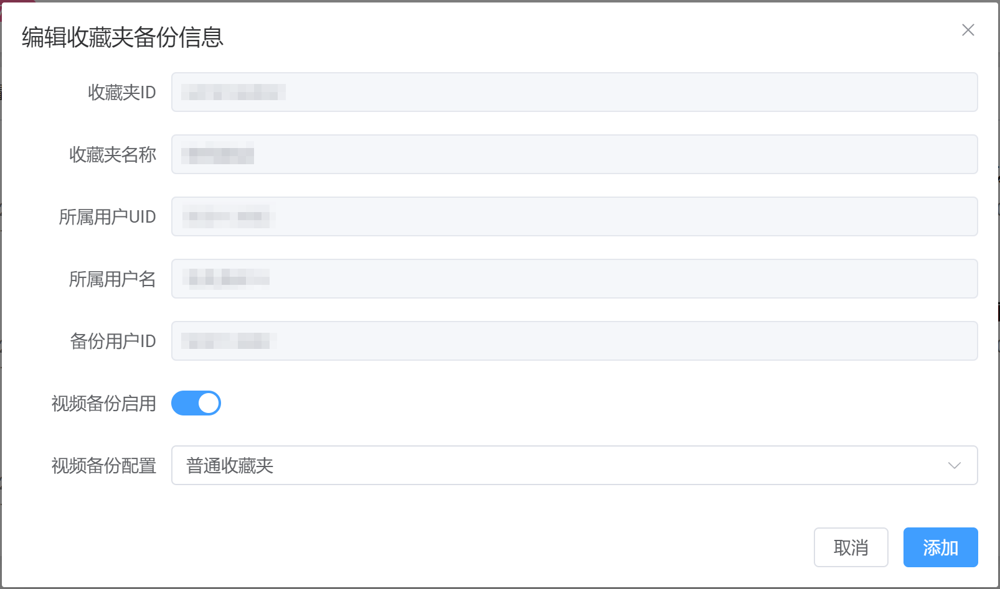

到这里，选择视频备份配置即可，点击添加按钮以完成添加。

### 历史记录备份

首次使用需要创建一个历史记录备份配置，点击右上角的小齿轮按钮，进行配置（这里我放的是修改配置的图）。

首先是自动删除的方法，可以按天数，按条目数或者硬盘容量占用。超出限制的视频将会被删除，如果视频失效了将永久保存，失效的不计入硬盘占用计算。

然后是排除发布日期长度，不填则不排除，这个将会排除掉多少天前发布的视频。

接着就是up主黑名单，顾名思义，在这个名单里的UP主将不会被备份。名称你可以填错，但是uid千万别填错。

最后一个视频备份配置，这里就不重复了，建议历史记录的备份配置的优先级要在收藏夹之下。

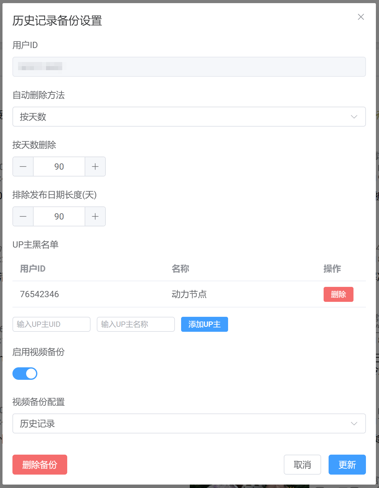

### UP主备份

输入UID添加即可。需要注意的一点就，是如果说有多个用户，不能同时备份一个up主，当然你也可以选择移交备份用户。

这里就不放截图了。。。

解释一下备份起始时间点：如果你不想备份up主创号以来所有的视频，可以选择从某一个时间点开始备份，这个时间点以前发布的视频就不会被备份了。该属性仅对第一次备份有效，如果你后期修改了这个值，将不会删除更加新的视频或者下载更加旧的视频。

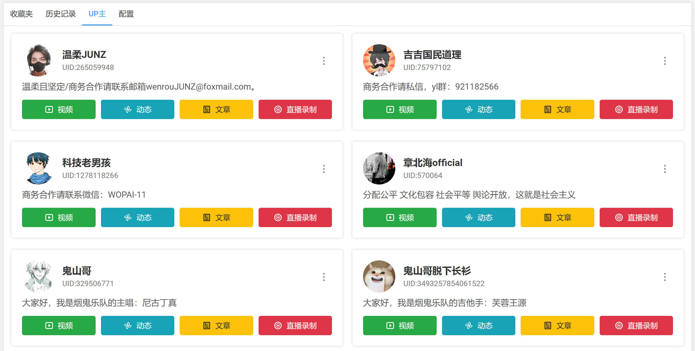

PS：动态还有文章的备份我不想做了，太复杂了那东西。直播录制后期会考虑加。

### 备份设置

任务池大小：可以同时备份/更新多少条视频，也可以将它叫做最原本的线程池。默认1，多线程推荐4。

备份循环间隔：顾名思义，多少分钟后来查询一下收藏夹等备份项的新内容。

公共大会员账号UID：如果你添加了多个用户有一个是大会员，但有一些没有大会员。设置该项后，没有大会员的账号，将用该大会员的帐号进行视频的解析与下载，评论依然使用当前原进行下载。

全局UP主黑名单：顾名思义，不废话了

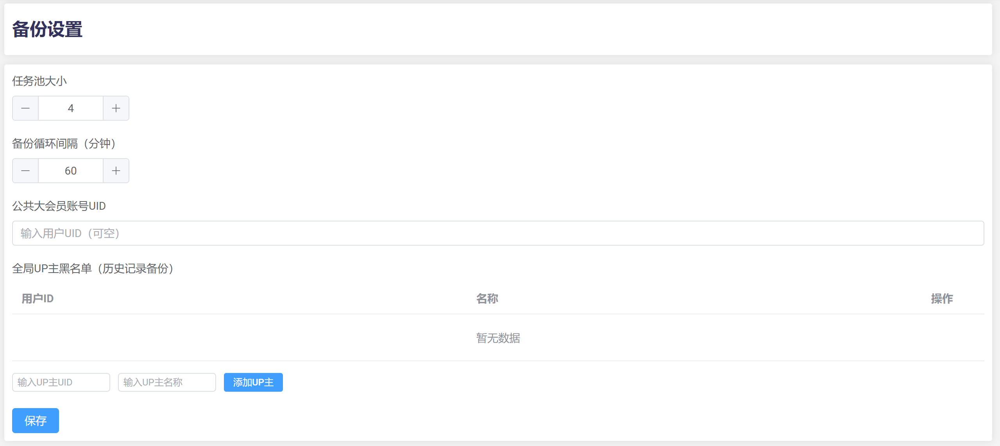

一切准备就绪后，点击主页的**启动备份**就可以运行了。

在备份运行期间，不可以修改任何与备份相关的配置。比如修改备份项的配置，添加备份项等。

**如果你的备份配置写了半天，发现还在运行，无法保存配置，怎么办？**

此时新开一个浏览器标签页，到主页停止存档姬运行，然后回到原来的窗口，保存你的配置就可以了。

## 对特定视频进行更新

到视频的详细信息这一栏

### 立即更新

顾名思义。如果评论涨了很多或者视频分评多了等，可以点这个来更新一下。

为了避免与未来存在的更新任务冲突，如果内容更新任务列表里有此视频的更新任务，将无法进行更新，需要清除该视频的更新任务。

更新后视频优先级将设置为FINAL最高，其他任何备份项新增了此视频将不会被覆盖。

### 添加更新任务

向更新任务列表中添加任务。和视频备份配置中的一样，只不过起点时间为现在。**用于处理视频发布之后很长时间后因某种事件又火了的情况**。

请注意，添加新任务会移除原本已存在的更新任务！并且将视频优先级设置为FINAL最高，其他任何备份项新增了此视频将不会被覆盖。

如果你觉得填写更新计划过于麻烦，还可以从视频备份备份配置导入。

# 视频条目状态展示


- 失效  
  
- UP主删除(被锁定后删除也为此状态)  
  
- UP主设置仅自己可见  
  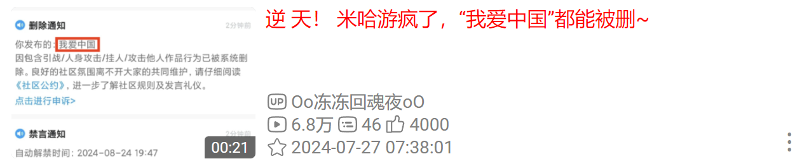
- ShadowBan（类似评论的）或其他原因  
  
- 收藏夹屏蔽（“已失效”都不给留的那种）注：仅收藏夹条目。是条纹标识，标题样式为视频的状态 
  
- 失效且未备份的收藏视频（历史记录备份可以拯救标题与封面）  
  
- 视频可观看但禁止搜索 （紫色标题，图片待补充）


# [doge]表情渲染

方括号表情包不内置在前端，需要到评论表情管理这里手动更新获取最新的评论表情包。如果评论列表显示的是`[doge]`而非表情图，请来这里更新一下。其他复杂的大表情暂不支持。

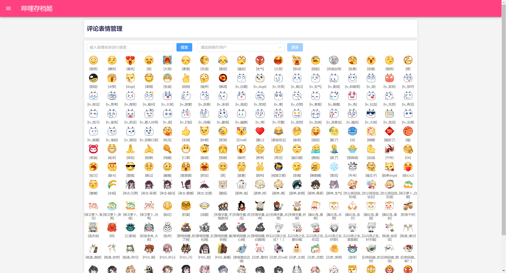

# 版本升级

有新版更新，下载到jar包后直接替换原jar包即可

不提倡降级操作，如果觉得新版不合意，欢迎反馈！若涉及到数据库结构更新迭代，降级将导致严重后果！！！

# 使用MySql数据库

本程序默认使用SQLite数据库，便于运行与迁移，但是性能欠佳。除此之外还支持MySql数据库。如果需要支持别的数据库，请你自己修改代码编译。

使用MySql数据库，配置文件示例：

```yaml
spring:
  datasource:
    master:
#      jdbc-url: "jdbc:sqlite:${files.root}/bilibili_archive.db?journal_mode=WAL"
#      driver-class-name: "org.sqlite.JDBC"
      jdbc-url: jdbc:mysql://192.168.8.204:3306/bilibili_archive_master
      username: root
      password: password
      driver-class-name: "com.mysql.cj.jdbc.Driver"
      #maximum-pool-size: 1 #数据库连接池大小，仅对非sqlite数据库生效，sqlite默认为1且即使设置此值也不会生效。可不填来使用默认
    comment:
#      jdbc-url: "jdbc:sqlite:${files.archives}/comments.db?journal_mode=WAL"
#      driver-class-name: "org.sqlite.JDBC"
      jdbc-url: jdbc:mysql://192.168.8.204:3306/bilibili_archive_comment
      username: root
      password: password
      driver-class-name: "com.mysql.cj.jdbc.Driver"
      #maximum-pool-size:
```

由于评论数据过于庞大，本软件将分为主（视频信息、备份设置等）数据库与评论数据库，分库存储。因为评论头像数据小且多，不以单文件来存储，而是存到数据库里。

你无需导入sql文件来创建表，本软件采取类似Android数据库的版本管理措施，由程序处理表的创建与版本升级要做的操作，你只需创建一个空的数据库即可。

# 特别感谢

- [ArtPlayer](https://artplayer.org/) 视频播放器
- [mermaid](https://mermaid.js.org/) （评论树状图实现）
- [hevue-img-preview](https://heyongsheng.github.io/) 图片预览

其他依赖库见项目的package.json与pom.xml

# 声明

本项目仅供SpringBoot+Vue开发学习与个人存档备份所使用。

本程序采取自我限流措施，类似哔哩漫游。为保护软件及其开发者，请勿在b站大张旗鼓的宣传本软件。不许在我的其他项目及其相关视频动态提到本项目。同时更不要在外网反贼群体（尤其是不懂编程的）宣传本软件，我不想承担任何政治风险😅！！